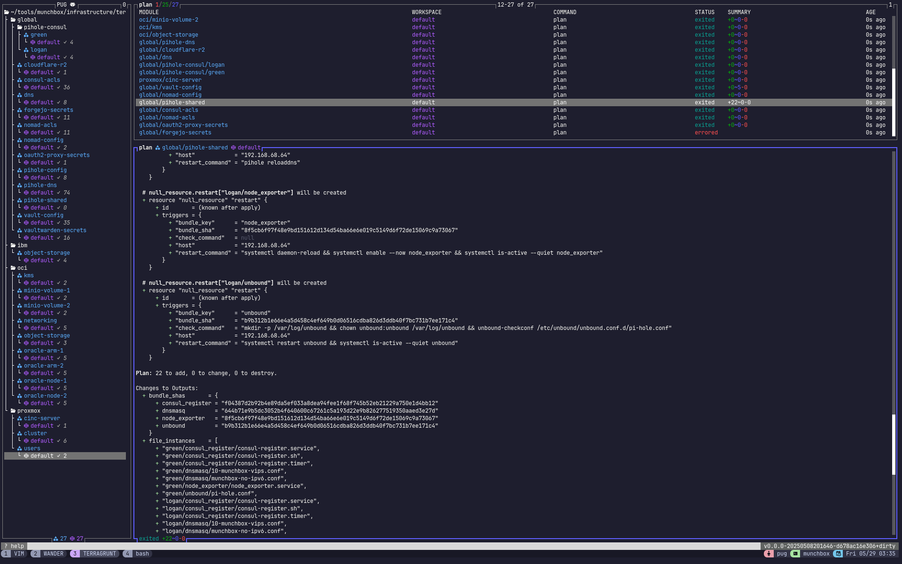

# infrastructure/terragrunt/

All Munchbox infrastructure (Vault config, ACLs, DNS, secrets, VM
provisioning, Pi-hole, OAuth2-Proxy, etc.) managed declaratively via
terragrunt-wrapped terraform.

> **Style guide:** [STYLE_GUIDE.md](./STYLE_GUIDE.md) -- module layout,
> leaf composition rules, comment forms, testing standards. Self-contained;
> nothing else in the repo is authoritative for terraform/terragrunt style.

<div align="center">



</div>

---

## Layout

```
infrastructure/terragrunt/
+-- root.hcl                    # Centralized config: paths, locals, generate blocks, remote_state
+-- _env_helpers/               # One per module; bridges root.hcl locals -> module inputs
+-- modules/                    # Reusable terraform modules (one concern per module)
+-- global/                     # Provider-agnostic leaves (consul-acls, vault-config, dns, ...)
+-- oci/                        # OCI per-node + per-service leaves
+-- proxmox/                    # Proxmox cluster + per-VM leaves
+-- ibm/                        # IBM Cloud leaves
```

Every leaf is **exactly two `include` blocks** -- `root` + the module's
env_helper. Anything you'd write into the leaf (dependencies, locals,
inputs, generate blocks) goes in the env_helper instead.

---

## Anatomy of a module

```
modules/<name>/
+-- versions.tf       # required_providers; honest deps only
+-- providers.tf      # provider {} configs (when the module needs aliases or auth wiring)
+-- variables.tf      # All inputs; sensitive ones marked sensitive=true
+-- main.tf           # Resources; box-section headers per logical group
+-- outputs.tf        # Outputs other leaves/modules may depend on
+-- Makefile          # `include ../_common.mk`
+-- tests/
    +-- default.tftest.hcl   # mock_provider + plan-only assertions
```

`_common.mk` provides the standard target set: `fmt`, `validate`, `lint`
(tflint), `trivy`, `checkov`, `test` (`terraform test`), and `verify`
(all of the above). `make verify` is the gate every module change has to
clear.

---

## Anatomy of a leaf

A leaf is the **invocation site** for a module on a specific target. Two
`include` blocks; no other content:

```hcl
# -----------------------------------------------------------------------------
# PI-HOLE CONFIG LEAF
# -----------------------------------------------------------------------------

include "root" {
  path = find_in_parent_folders("root.hcl")
}

include "pihole-config" {
  path   = "${get_repo_root()}/infrastructure/terragrunt/_env_helpers/pihole-config.hcl"
  expose = true
}
```

If you find yourself wanting to add `dependency {}`, `locals {}`, `inputs
{}`, or `generate {}` to a leaf -- it belongs in the env_helper. Single
exception: a per-leaf path-keyed lookup (see #"Path-keyed config" in the
style guide), which is still in the env_helper, just with a `basename(
get_terragrunt_dir())` switch.

---

## Anatomy of an env_helper

One env_helper per module. Pulls statics from `root.hcl`, secrets from
env vars, and wires them into the module's `inputs`:

```hcl
terraform {
  source = "${get_repo_root()}/infrastructure/terragrunt/modules//<name>"
}

locals {
  root = read_terragrunt_config(find_in_parent_folders("root.hcl"))
}

inputs = {
  some_static = local.root.locals.some_static
  some_secret = get_env("TF_VAR_some_secret", "")
}
```

If multiple leaves share the same module (e.g. `global/pihole-consul/green`
and `global/pihole-consul/logan`), the env_helper switches inside based on
`basename(get_terragrunt_dir())` -- the leaf dir name is the routing key.
Per-leaf config goes into a path-keyed map in `root.hcl`.

---

## root.hcl

The single source of truth for cross-leaf config. Sections:

- **Path parsing** -- `node_name` / `provider_type` derived from the leaf's
  directory; env_helpers key off these.
- **Provider-specific defaults** -- `aws_defaults`, `oci_defaults`,
  `proxmox_defaults`.
- **Network CIDRs, WireGuard, SSH** -- shared across every leaf that needs
  to reason about the cluster topology.
- **`proxmox_vm_groups`** -- the source of truth for every Proxmox VM. Keyed
  by `terragrunt/proxmox/<dir>/`, looked up via `basename(...)`.
- **Path-keyed per-leaf maps** -- `block_volume_oci_configs`,
  `remote_files_configs`, etc. Used by env_helpers that serve multiple
  leaves of the same module.
- **`remote_state`** -- Consul backend at
  `terraform/munchbox/<provider>/<node_name>`. Each leaf has isolated state.
- **`generate "providers"`** -- currently commented out; each module owns its
  own provider configs (see issue #122 for the historical context).

---

## Common ops

From a leaf dir:

```bash
source munchbox-env.sh           # ALWAYS first -- exports TF_VAR_*, vault creds, etc.
cd infrastructure/terragrunt/<leaf>
terragrunt init                  # cached unless backend changed
terragrunt plan
terragrunt apply
terragrunt destroy               # state-only when env_helper guards against missing inputs
```

From a module dir:

```bash
make verify     # fmt + validate + lint + test (the standard gate)
make test       # terraform test only (plan-only assertions)
make trivy      # ad-hoc IaC misconfig scan
make checkov    # ad-hoc compliance scan
make clean      # rm .terraform/ + lockfile
```

State migrations between modules / resource renames:

```bash
terragrunt state mv <old> <new>
terragrunt state replace-provider <old/provider> <new/provider>
terragrunt import '<resource>.<name>' '<id>'
```

---

## Adding a new module

1. `mkdir modules/<name>/{tests}` plus `versions.tf` + `main.tf` +
   `variables.tf` + `outputs.tf` + `Makefile` (one-liner including
   `_common.mk`).
2. Declare only the providers you actually use in `versions.tf`. Do not
   list every third-party provider "to be safe" -- that's an issue tracked
   in #122 history.
3. Write a `tests/default.tftest.hcl` using `mock_provider` for every
   provider the module references, with `command = plan` only (see
   STYLE_GUIDE #8).
4. Run `make verify` from the module dir until clean.
5. Add `_env_helpers/<name>.hcl` that sources the module and wires inputs.
6. Add a leaf under `global/`, `oci/`, etc. -- two `include` blocks, that's
   it.

---

## Adding a new Proxmox VM

1. Add the VM entry under `root.hcl` -> `locals.proxmox_vm_groups.<group>.
   <hostname>` with target_node / vmid / memory / cores / disk / cloud_init.
2. Apply the existing leaf for that group:
   ```bash
   cd proxmox/<group> && terragrunt apply
   ```
3. The Proxmox provider handles the actual VM creation; cinc-client
   converges it on first boot. There is no per-VM leaf directory unless
   the VM is in its own group (e.g. `cinc-server`).

---

## Adding a per-host leaf (Pi-hole-consul shape)

When one module serves multiple hosts with different inputs, the env_helper
becomes a switch instead of a pass-through:

1. Create the per-host leaf dirs: `global/<module>/<host1>/`,
   `global/<module>/<host2>/`. Each is the same two-include skeleton.
2. Add a path-keyed config map under `root.hcl` keyed by the leaf dir name:
   ```hcl
   <module>_configs = {
     host1 = { ... }
     host2 = { ... }
   }
   ```
3. In the env_helper, `basename(get_terragrunt_dir())` selects the slice.
4. If file CONTENT differs per leaf, use `templatefile()` referencing a
   shared `_templates/` dir alongside the leaves.

---

## State management

State lives in Consul at:

```
terraform/munchbox/<provider>/<node_name>
```

Where `<provider>` and `<node_name>` are parsed from the leaf's filesystem
path by root.hcl. Each leaf has isolated state; destroying one doesn't
touch another. Locking is enabled.

---

## Provider override (Pi-hole)

`infrastructure/providers/terraform-provider-pihole/` is a git submodule
with a local-fork build of `ryanwholey/pihole` that speaks the Pi-hole v6
REST API. Wired in via `~/.terraformrc`:

```
provider_installation {
  dev_overrides {
    "ryanwholey/pihole" = "/home/<user>/tools/munchbox/infrastructure/providers/terraform-provider-pihole"
  }
  direct {}
}
```

Used only by `modules/pihole-dns`. Issue #123 tracks consolidating onto
`dklesev/pihole` so this can be retired.

---

## Related

- [STYLE_GUIDE.md](./STYLE_GUIDE.md) -- terragrunt/terraform coding
  conventions, comment forms, testing standards.
- [modules/README.md](./modules/README.md) -- per-module catalog + the
  bootstrap module documentation.
- [Top-level CLAUDE.md](../../CLAUDE.md) -- repo-wide conventions.
- [Munchbox kanban](https://github.com/users/afreidah/projects/4) -- open
  terragrunt work tracked in Project #4.
